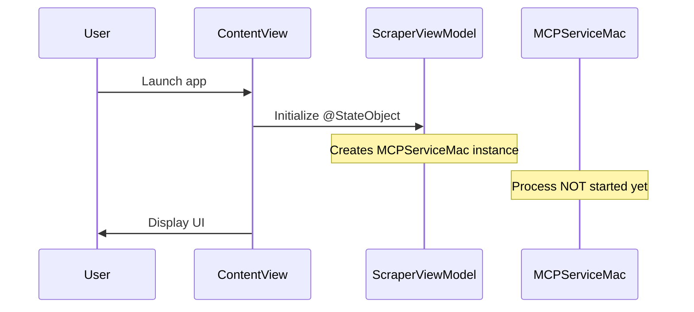
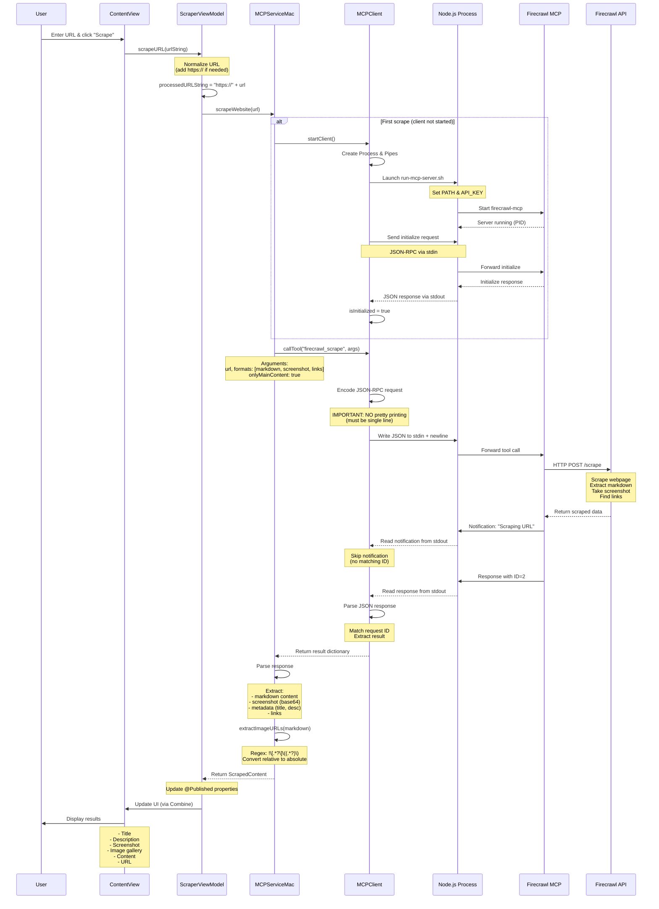
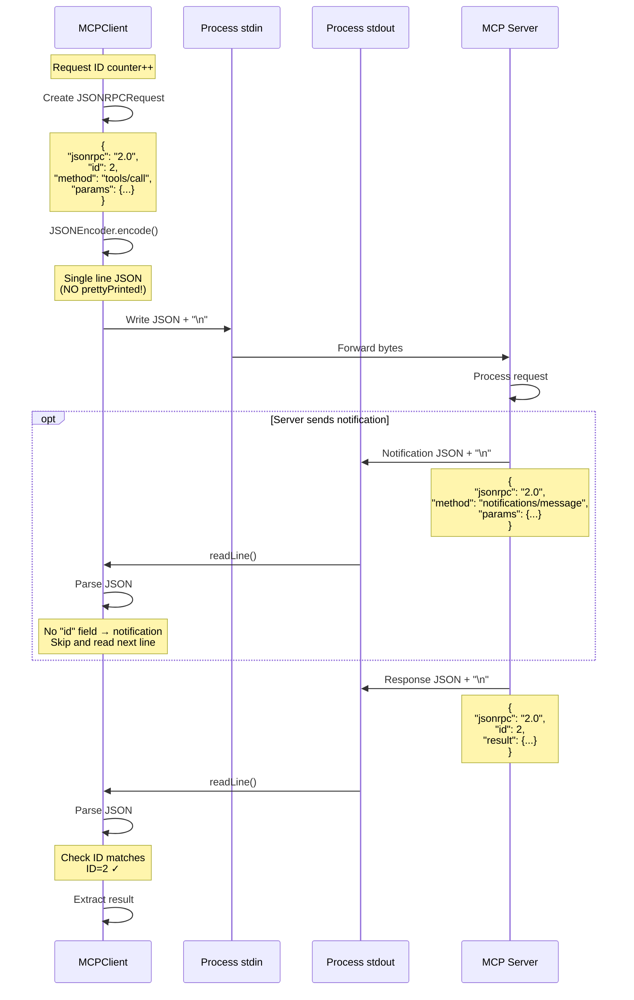
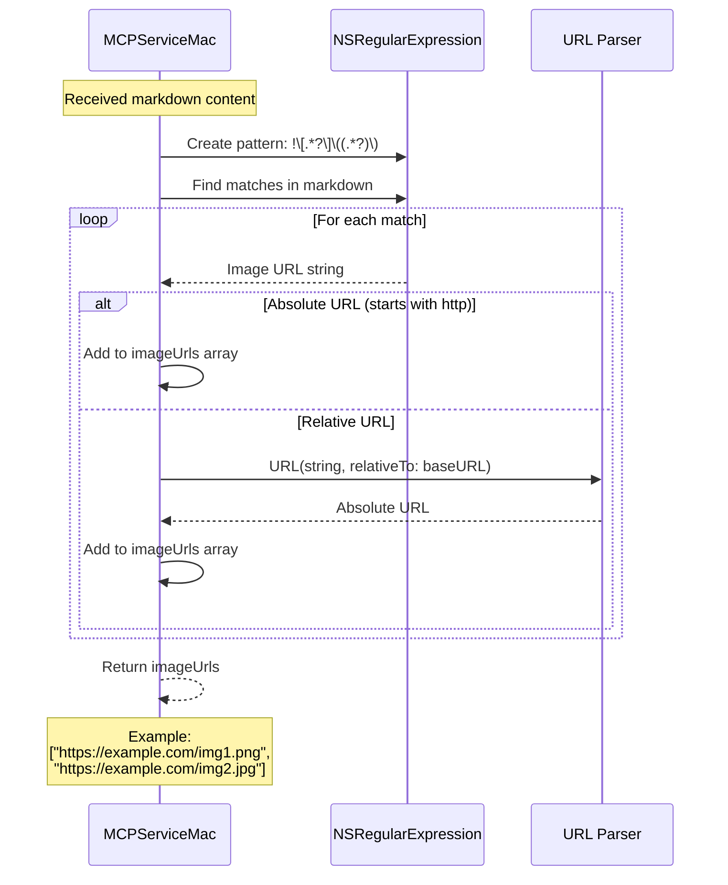

# FirecrawlScraper Architecture Documentation

## Table of Contents
1. [Overview](#overview)
2. [System Architecture](#system-architecture)
3. [Component Details](#component-details)
4. [Sequence Diagrams](#sequence-diagrams)
5. [Data Flow](#data-flow)
6. [Key Implementation Details](#key-implementation-details)

---

## Overview

FirecrawlScraper is a macOS/iOS application that scrapes web content using the Firecrawl MCP (Model Context Protocol) Server. The app communicates with a Node.js-based MCP server via stdio (standard input/output) to fetch web page content, screenshots, and extract images.

### Key Technologies
- **Swift/SwiftUI**: Frontend UI and business logic
- **MCP (Model Context Protocol)**: Communication protocol for tool calling
- **JSON-RPC 2.0**: Message format for MCP communication
- **Firecrawl API**: Backend service for web scraping
- **Node.js/npx**: Runtime for the MCP server

---

## System Architecture

```
┌─────────────────────────────────────────────────────────────┐
│                     SwiftUI Interface                        │
│                      (ContentView)                           │
└────────────────────────┬────────────────────────────────────┘
                         │
                         ▼
┌─────────────────────────────────────────────────────────────┐
│                   ScraperViewModel                           │
│            (Manages UI state & orchestration)                │
└────────────────────────┬────────────────────────────────────┘
                         │
                         ▼
┌─────────────────────────────────────────────────────────────┐
│                    MCPServiceMac                             │
│         (Business logic for web scraping)                    │
└────────────────────────┬────────────────────────────────────┘
                         │
                         ▼
┌─────────────────────────────────────────────────────────────┐
│                     MCPClient                                │
│        (JSON-RPC communication manager)                      │
└────────────────────────┬────────────────────────────────────┘
                         │
                         ▼ stdio pipes
┌─────────────────────────────────────────────────────────────┐
│              Node.js Process (via wrapper script)            │
│                 firecrawl-mcp server                         │
└────────────────────────┬────────────────────────────────────┘
                         │
                         ▼ HTTPS
┌─────────────────────────────────────────────────────────────┐
│                  Firecrawl Cloud API                         │
│              (Web scraping service)                          │
└─────────────────────────────────────────────────────────────┘
```

---

## Component Details

### 1. ContentView (UI Layer)
**File**: `ContentView.swift`

**Responsibilities**:
- Display URL input field
- Show loading indicator during scraping
- Display scrape results (title, description, screenshot, images, content)
- Handle user interactions

**Key Features**:
- Auto-adds `https://` to URLs without scheme
- Displays base64-encoded screenshots
- Shows horizontal scrollable gallery of extracted images
- Async image loading with error handling

### 2. ScraperViewModel (State Management)
**File**: `ScraperViewModel.swift`

**Responsibilities**:
- Manage app state (@Published properties)
- Validate and normalize URLs
- Orchestrate scraping operations
- Handle errors and update UI state

**Key Properties**:
```swift
@Published var scrapedContent: ScrapedContent?
@Published var isLoading: Bool
@Published var errorMessage: String?
```

### 3. MCPServiceMac (Business Logic)
**File**: `MCPServiceMac.swift`

**Responsibilities**:
- Start/stop MCP client
- Call Firecrawl scraping tool
- Parse MCP responses
- Extract images from markdown content
- Transform data into ScrapedContent model

**Key Methods**:
- `startClient()`: Initialize MCP connection
- `scrapeWebsite(url:)`: Perform scraping operation
- `extractImageURLs(from:baseURL:)`: Extract images from markdown

### 4. MCPClient (Protocol Handler)
**File**: `MCPClient.swift`

**Responsibilities**:
- Manage subprocess (Node.js MCP server)
- Implement JSON-RPC 2.0 protocol
- Handle stdio communication
- Parse responses and handle notifications

**Key Methods**:
- `start()`: Launch MCP server process
- `initialize()`: Send MCP initialize request
- `callTool()`: Execute MCP tool
- `readLine()`: Read JSON-RPC messages from pipe

### 5. MCP Server Wrapper
**File**: `run-mcp-server.sh`

**Purpose**: Set up environment for Node.js process

**Contents**:
```bash
#!/bin/bash
export PATH="/Users/.../node/v24.12.0/bin:$PATH"
export FIRECRAWL_API_KEY="fc-..."
exec npx -y firecrawl-mcp
```

### 6. Firecrawl MCP Server
**Package**: `firecrawl-mcp` (npm)

**Responsibilities**:
- Implement MCP protocol
- Call Firecrawl API
- Return scraped content

---

## Sequence Diagrams

### 1. Application Startup



### 2. Web Scraping Flow (Complete)



### 3. JSON-RPC Communication Detail



### 4. Image Extraction Flow



---

## Data Flow

### Request Flow

```
User Input (URL)
    ↓
URL Normalization (add https://)
    ↓
ScraperViewModel.scrapeURL()
    ↓
MCPServiceMac.scrapeWebsite()
    ↓
MCPClient.callTool()
    ↓
JSON-RPC Request → stdin
    ↓
Node.js Process (run-mcp-server.sh)
    ↓
Firecrawl MCP Server
    ↓
Firecrawl Cloud API
```

### Response Flow

```
Firecrawl API (JSON response)
    ↓
Firecrawl MCP Server (format to MCP)
    ↓
Node.js Process
    ↓
stdout → JSON-RPC Response
    ↓
MCPClient.readLine() (parse)
    ↓
MCPServiceMac (extract data)
    ↓
Image URL extraction (regex)
    ↓
ScrapedContent model
    ↓
ScraperViewModel (@Published)
    ↓
ContentView (SwiftUI update)
    ↓
User sees results
```

### Data Transformations

```
1. Raw API Response (from Firecrawl):
{
  "markdown": "# Title\n...",
  "screenshot": "base64...",
  "metadata": {
    "title": "Page Title",
    "description": "...",
    ...
  }
}

2. MCP Response Format:
{
  "content": [{
    "text": "{\"markdown\":\"...\",\"screenshot\":\"...\",\"metadata\":{...}}",
    "type": "text"
  }]
}

3. Parsed in Swift:
parsedData["markdown"] as? String
parsedData["screenshot"] as? String
parsedData["metadata"] as? [String: Any]

4. Image Extraction:
Markdown: ""
    ↓ Regex
Images: ["https://example.com/image.png"]

5. Final Model:
ScrapedContent(
  title: "Page Title",
  description: "...",
  content: "# Title\n...",
  url: "https://example.com",
  metadata: {...},
  screenshot: "base64...",
  images: ["https://..."]
)
```

---

## Key Implementation Details

### 1. Why the Wrapper Script?

**Problem**: macOS GUI apps don't inherit shell PATH environment variables.

**Solution**: `run-mcp-server.sh` wrapper script that:
- Sets PATH to include Node.js binaries (from nvm)
- Sets FIRECRAWL_API_KEY environment variable
- Executes `npx -y firecrawl-mcp`

**Without wrapper**: App can't find `npx` or `node` commands.

### 2. JSON-RPC Line-Based Protocol

**Critical Issue**: The MCP protocol expects **one JSON message per line**.

**Wrong** (with prettyPrinted):
```json
{
  "jsonrpc": "2.0",
  "id": 1,
  "method": "initialize"
}
```
This has 4 lines! The server will only read the first `{` and fail.

**Correct** (single line):
```json
{"jsonrpc":"2.0","id":1,"method":"initialize"}
```

**Implementation**:
```swift
let encoder = JSONEncoder()
// NO prettyPrinted!
let requestData = try encoder.encode(request)
```

### 3. Handling Notifications vs Responses

**Notifications**: Messages without an `id` field
```json
{"jsonrpc":"2.0","method":"notifications/message","params":{...}}
```

**Responses**: Messages with an `id` field matching the request
```json
{"jsonrpc":"2.0","id":2,"result":{...}}
```

**Implementation**:
```swift
while attempts < maxAttempts {
    let responseData = try await readLine(from: outputPipe)

    if let json = try? JSONSerialization.jsonObject(with: responseData) {
        if json["method"] != nil && json["id"] == nil {
            // Skip notification, continue reading
            continue
        }
    }

    let response = try decoder.decode(JSONRPCResponse.self, from: responseData)
    if response.id == currentRequestID {
        return response // Found matching response!
    }
}
```

### 4. Image URL Extraction

**Markdown Pattern**:
```markdown


```

**Regex Pattern**:
```swift
let pattern = #"!\[.*?\]\((.*?)\)"#
```

**Explanation**:
- `!` - Literal exclamation mark
- `\[.*?\]` - Alt text in brackets (non-greedy)
- `\(` - Opening parenthesis
- `(.*?)` - **Capture group**: URL (non-greedy)
- `\)` - Closing parenthesis

**Relative URL Handling**:
```swift
if let imageURL = URL(string: urlString, relativeTo: baseURL)?.absoluteString {
    imageUrls.append(imageURL)
}
```

Converts `/logo.png` → `https://example.com/logo.png`

### 5. Stdio Communication

**Pipes Setup**:
```swift
inputPipe = Pipe()   // stdin to process
outputPipe = Pipe()  // stdout from process
errorPipe = Pipe()   // stderr from process

process.standardInput = inputPipe
process.standardOutput = outputPipe
process.standardError = errorPipe
```

**Writing**:
```swift
var dataToSend = requestData
dataToSend.append(contentsOf: "\n".utf8)
inputPipe.fileHandleForWriting.write(dataToSend)
```

**Reading** (low-level file descriptor):
```swift
let fileDescriptor = handle.fileDescriptor
var readBuffer = [UInt8](repeating: 0, count: 1024)
let bytesRead = read(fileDescriptor, &readBuffer, 1024)

if bytesRead > 0 {
    buffer.append(Data(readBuffer[0..<bytesRead]))
}
```

### 6. Async/Await Integration

**Problem**: MCP communication is asynchronous.

**Solution**: Swift async/await with continuations

```swift
private func readLine(from pipe: Pipe) async throws -> Data {
    return try await withCheckedThrowingContinuation { continuation in
        DispatchQueue.global(qos: .userInitiated).async {
            // Blocking I/O on background thread
            let data = ... // read from pipe
            continuation.resume(returning: data)
        }
    }
}
```

This allows:
```swift
let response = try await sendRequest(method: "tools/call", params: params)
```

---

## Error Handling

### Common Errors

1. **Process Start Failed**
   - Cause: Wrapper script not found or not executable
   - Fix: Use absolute path to script

2. **Invalid URL**
   - Cause: URL missing scheme
   - Fix: Auto-prepend `https://` in ScraperViewModel

3. **Tool Parameter Validation Failed**
   - Cause: Invalid arguments to firecrawl_scrape
   - Fix: Ensure URL has proper scheme

4. **Timeout**
   - Cause: readLine() didn't receive data
   - Fix: Increased timeout to 60 seconds

5. **No API Key**
   - Cause: FIRECRAWL_API_KEY not set
   - Fix: Set in wrapper script

### Error Propagation

```
Low-level error (Process)
    ↓
MCPClient.MCPError
    ↓
MCPServiceMac.FirecrawlError
    ↓
ScraperViewModel.errorMessage
    ↓
ContentView displays error
```

---

## Performance Considerations

1. **Subprocess overhead**: ~100ms to start Node.js process (once per app session)
2. **API latency**: 1-5 seconds depending on page complexity
3. **Screenshot encoding**: Base64 encoding adds ~33% size overhead
4. **Image loading**: AsyncImage loads images asynchronously, non-blocking
5. **Memory**: Screenshots can be large (1-2MB base64), consider memory limits

---

## Security Considerations

1. **API Key Storage**: Currently hardcoded in wrapper script - should use Keychain in production
2. **Subprocess Isolation**: Node.js process runs with app's privileges
3. **URL Validation**: Basic validation, consider additional sanitization
4. **HTTPS**: Always use HTTPS for external URLs

---

## Future Improvements

1. **Caching**: Cache scrape results to reduce API calls
2. **Batch Scraping**: Support multiple URLs
3. **Export**: Export results to PDF, markdown, or JSON
4. **Settings**: Configure API key, timeout, screenshot quality via UI
5. **Error Recovery**: Automatic retry on transient failures
6. **Progress Tracking**: Show detailed progress during scraping

---

## Glossary

- **MCP**: Model Context Protocol - A protocol for AI tools to communicate
- **JSON-RPC**: Remote procedure call protocol using JSON
- **stdio**: Standard input/output streams for process communication
- **npx**: Node Package Execute - Runs npm packages
- **nvm**: Node Version Manager - Manages Node.js versions
- **SwiftUI**: Apple's declarative UI framework
- **Combine**: Apple's reactive programming framework (@Published)

---

## Conclusion

The FirecrawlScraper demonstrates a multi-layer architecture combining:
- Native Swift UI (SwiftUI)
- JSON-RPC protocol implementation
- Subprocess management (Node.js)
- External API integration (Firecrawl)
- Async/await concurrency
- Regex-based content extraction

The key innovation is the wrapper script that enables macOS GUI apps to communicate with Node.js-based MCP servers despite PATH limitations.
